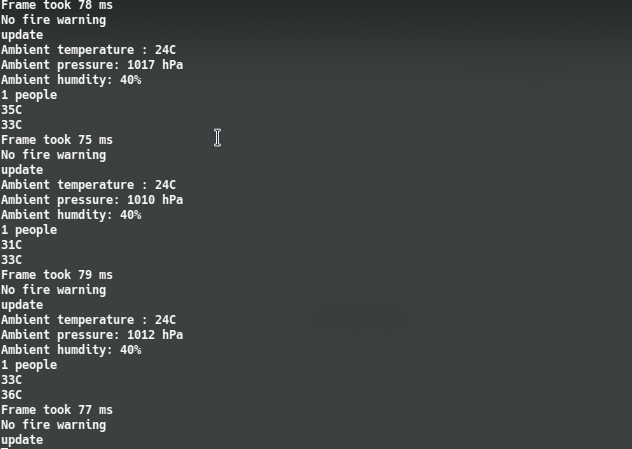

# smart-home
[](https://github.com/slowy07/smart-home/actions/workflows/python-app.yml)
[](LICENSES)
[](https://github.com/slowy07/smart-home/actions/workflows/codeql-analysis.yml)

## install tsensor (thermal)
```tsensor``` install
```bash
echo "deb https://packages.cloud.google.com/apt coral-edgetpu-stable main" | sudo tee /etc/apt/sources.list.d/coral-edgetpu.list
curl https://packages.cloud.google.com/apt/doc/apt-key.gpg | sudo apt-key add -

sudo apt-get install python3-opencv
sudo apt-get install libedgetpu1-max
sudo apt-get install python3-edgetpu
sudo apt-get install libatlas-base-dev
sudo apt-get install libjasper-dev
sudo apt-get install libhdf5-dev
sudo apt-get install libqt4-dev
sudo apt-get install git
```
*after that install more library via pip*
```bash
pip3 install -r requirements.txt
```

